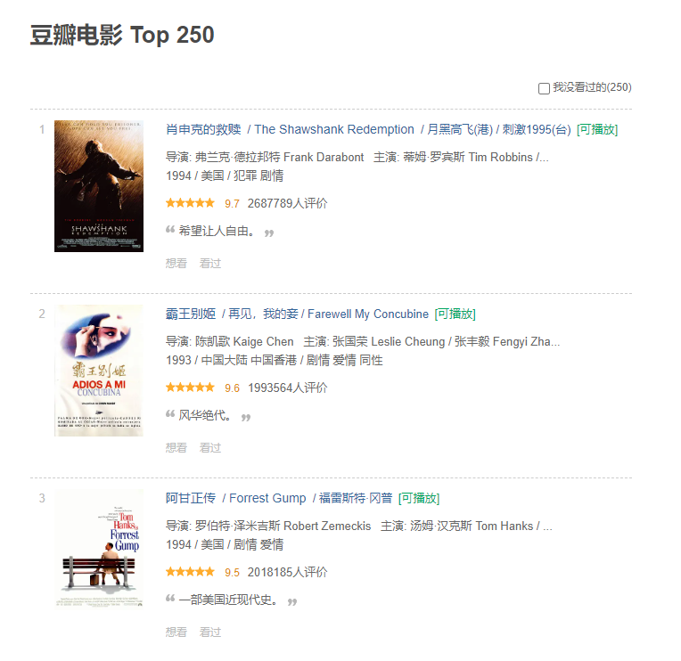

# 爬取豆瓣电影 Top250

尝试写的一个go爬虫

## 目标

我们的目标站点是 [豆瓣电影 Top250](https://movie.douban.com/top250)



简单的分析一下目标源
- 一页共25条
- 含分页（共10页）且分页规则是正常的
- 每一项的数据字段排序都是规则且不变

## 开始

### 安装
```
$ go get -u github.com/PuerkitoBio/goquery
```

### 运行
```
$ go run main.go
```

### 数据


